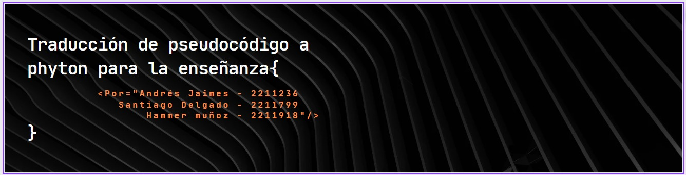

# Proyecto_automatas

En este proyecto se usaron expresiones regulares para traducir la sintaxis básica del lenguaje de código Python a pseudocódigo, además de su inverso, es decir, pseudocódigo a código Python.
De manera que permita ayudar a asimilar con más facilidad y velocidad las ideas básicas
